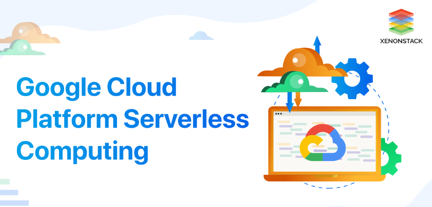
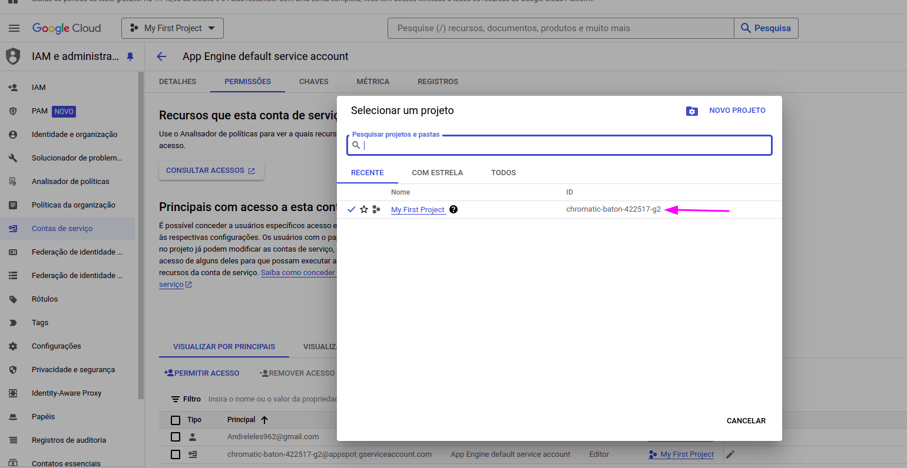
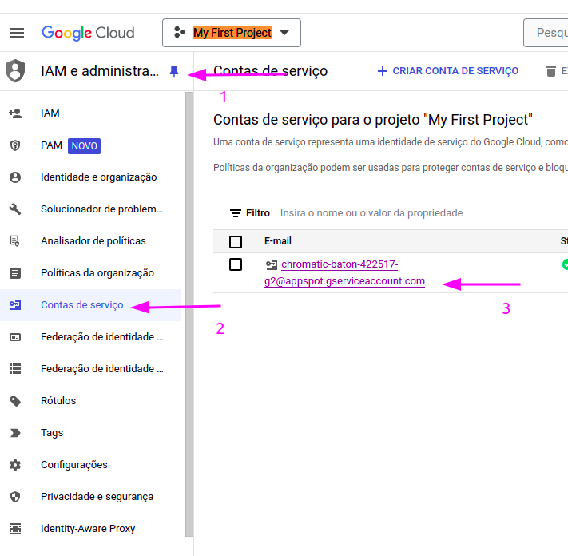
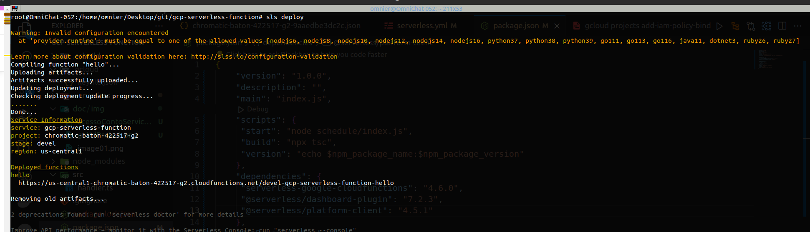
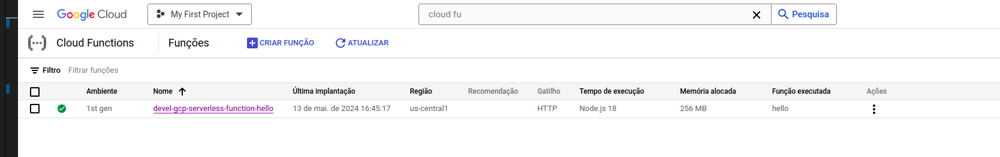
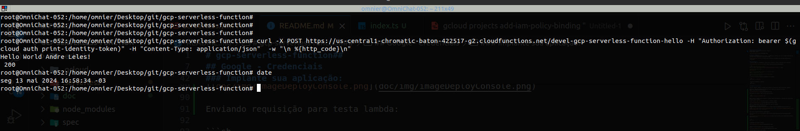
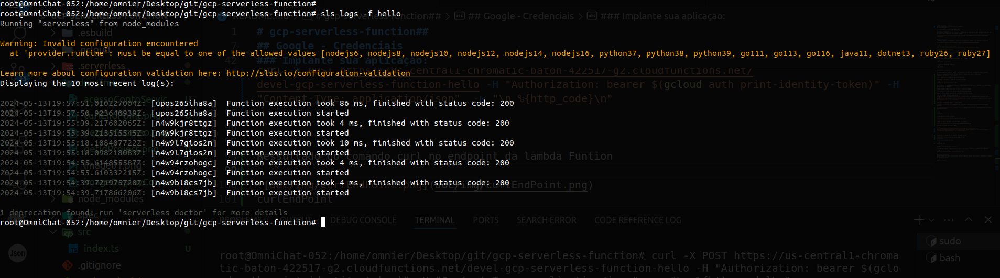
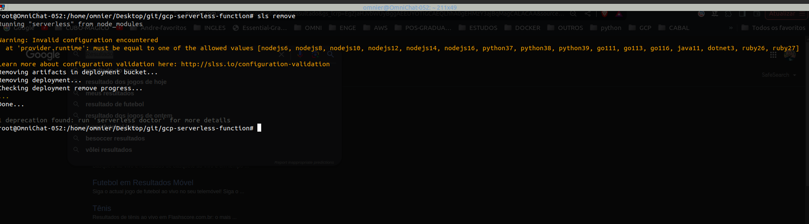
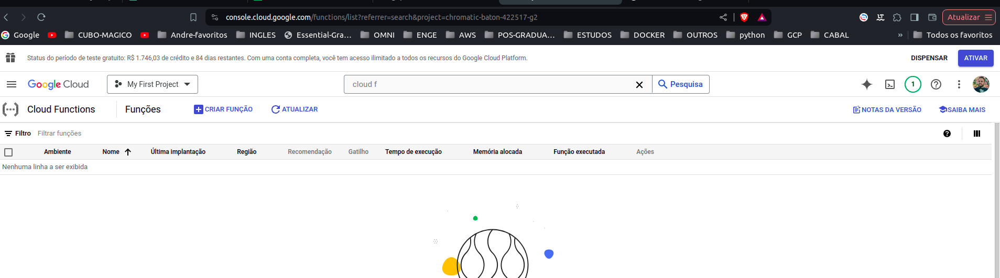

# gcp-serverless-function
Usando Google Cloud Platform Serverless Framework : 
Um guia passo a passo



## Google - Credenciais
O Serverless Framework precisa ter acesso às credenciais da conta da sua conta do Google Cloud para que ela possa criar e gerenciar recursos em seu nome.

[Link Documentação Site Oficial](https://www.serverless.com/framework/docs/providers/google/guide/credentials)


### Pré-requisitos
- Instale o Node.js (recomendamos a versão 18.x ou superior). Acesse o link baixo para instalação.

[Link Documentação Site Oficial](https://nodejs.org/en/download/package-manager)

```sh
# installs NVM (Node Version Manager)
curl -o- https://raw.githubusercontent.com/nvm-sh/nvm/v0.39.7/install.sh | bash

# download and install Node.js
nvm install 20

# verifies the right Node.js version is in the environment
node -v # should print `v20.12.2`

# verifies the right NPM version is in the environment
npm -v # should print `10.5.0`
```
- Instale o Serverless Framework globalmente com o comando:

```sh
 npm install -g serverless
```

- Instale as depndencia do projeto:
```sh
 npm install
```

### Implante sua aplicação:

Execute o seguinte comando no terminal para implantar sua aplicação usando o Serverless Framework:

Adicione as seguintes permissão na conta de serviço defaul para realização de deploy
Pegue o Id da conta (My First Project)



Apois pega a id realize o login com sua conta principal.

```sh
 gcloud auth application-default login
```

Apois realizar o login e preciso executar o comando abaixo para adicionar a permissão para conta defaul de serviço que ja existe..

Primeir acesse o IAM e var em conta de Serviço conforme a imagem:



Agora no comando abaixo substitua dos dados pelo o que foi coletado.

YOUR_PROJECT_ID = chromatic-baton-123-g2

NAME@YOUR_PROJECT_ID.iam.gserviceaccount.com = chromatic-baton-123-g2@appspot.gserviceaccount.com
```sh
gcloud projects add-iam-policy-binding YOUR_PROJECT_ID --member "serviceAccount:NAME@YOUR_PROJECT_ID.iam.gserviceaccount.com" --role "roles/owner"
```

Apois essa configuração execute o deploy abaixo:

[Link Documentação Site Oficial](https://www.serverless.com/framework/docs/providers/google/guide/services)

[Link Documentação para criar um endpoint api-rest](https://www.serverless.com/framework/docs/providers/google/events/http)


```sh
sls deploy
```

O resultado com sucesso do Deploy:




Imagem na console da google Cloud com Deploy com sucesso:



Enviando requisição para testa lambda:

A url pegue a que retornou com sucesso durante o deploy

```sh
curl -X POST https://us-central1-chromatic-baton-422517-g2.cloudfunctions.net/devel-gcp-serverless-function-hello -H "Authorization: bearer $(gcloud auth print-identity-token)" -H "Content-Type: application/json"  -w "\n %{http_code}\n"

```

Resultado do comando curl no endpoint da lambda Funtion




### Verifique mensagem de logs:

```sh
serverless logs -f hello
```




## Encerrar o ambiente:
Quando terminar de testar sua aplicação, execute o seguinte comando para remover a lambda:

```sh
sls remove
```
Resultado da deleção do ambiente:



Status pela console da google CLoud


